**List of Abbreviations**
=========================

| Abbreviation | Full Form |
| :--- | :--- |
| **API** | Application Programming Interface |
| **CRUD** | Create, Read, Update, Delete |
| **JWT** | JSON Web Token |
| **ML** | Machine Learning |
| **MAE** | Mean Absolute Error |
| **ORM** | Object Relational Mapping |
| **RDBMS** | Relational Database Management System |
| **SDLC** | Software Development Life Cycle |
| **SPA** | Single Page Application |

**Chapter 1: Introduction**
===========================

The livestock sector is a foundational pillar of the global agricultural economy, contributing significantly to food security, poverty alleviation, and rural development. In developing nations, livestock is often referred to as "living capital," representing a primary source of income and financial stability for millions of small-scale farmers. However, despite its vital role, the mechanisms for trading livestock have remained largely traditional, manual, and localized, leading to significant economic leakages for the producers.

**1.1 Background of the Study**
-------------------------------

The traditional livestock marketing system is characterized by physical marketplaces or *mandis*, where buyers and sellers congregate periodically. While these markets provide a venue for trade, they are fraught with structural challenges. Farmers in remote areas often have to travel long distances, incurring high transportation costs and risking the health of their animals. Furthermore, the market is heavily dominated by intermediaries who exploit the lack of pricing transparency, often leaving farmers with a minimal share of the final consumer price.

In the era of the Fourth Industrial Revolution, digital transformation has begun to reshape various sectors of agriculture. E-commerce platforms have simplified the trade of crops and machinery; however, the livestock sector has lagged behind due to the complexities involved in valuing biological assets. Unlike standardized goods, each animal has unique attributes such as breed, age, weight, and health status that dictate its market value. 

Recent advancements in web development, real-time communication protocols, and Artificial Intelligence (AI) offer a unique opportunity to modernize this sector. By leveraging high-performance frameworks like FastAPI and React, it is now possible to create interactive marketplaces that bridge the gap between rural sellers and urban buyers. Moreover, the integration of Machine Learning (ML) can provide data-driven price estimations, ensuring a fair and transparent trading environment. This study explores the design and implementation of "AnimalMarket," a specialized platform aimed at revolutionizing livestock trading through technology.

**1.2 Problem Statement**
-------------------------

Despite the economic significance of the livestock sector, the current trading mechanisms face several critical challenges:

1.  **Market Inefficiency and Fragmentation:** Sellers are often limited to local geographic markets, reducing their exposure to potential buyers. Conversely, buyers lack a centralized platform to view available stock across different regions.
    
2.  **Pricing Disparity:** There is a lack of standardized pricing in the livestock market. Farmers often lack accurate market data and rely on rough estimates or the dictates of middlemen, leading to unfair valuations.
    
3.  **Transaction Risks:** Buying animals requires significant trust. Traditional digital classifieds often lack specialized features for livestock, such as detailed health metrics (weight, breed, age) or verification mechanisms, leading to fraud and safety concerns.
    
4.  **Communication Barriers:** The negotiation process is typically slow and disjointed, often requiring phone calls or physical visits that are time-consuming for both parties.
    

This thesis addresses these problems by developing a specialized web platform that connects buyers and sellers directly, provides AI-driven price guidance, and facilitates real-time communication.

**1.3 Objectives**
------------------

The primary objective of this project is to design and develop a full-stack web application tailored for the buying and selling of livestock. The specific objectives are as follows:

*   **To develop a user-friendly interface** using React.js that allows farmers and buyers to easily list, browse, and filter animal listings based on breed, location, and price.
    
*   **To implement a robust backend system** using FastAPI to handle secure user authentication, data management, and high-concurrency request processing.
    
*   **To integrate an AI-powered Price Estimator** using Machine Learning algorithms to analyze animal attributes (weight, age, breed) and provide a fair market price prediction, reducing information asymmetry.
    
*   **To facilitate real-time negotiation** by implementing a WebSocket-based chat system that enables instant, private communication between buyers and sellers.
    
*   **To establish a trust system** through a rating and review mechanism, allowing users to build credibility within the marketplace.
    

**1.4 Scope of the Project**
----------------------------

The scope of the "AnimalMarket" project encompasses the design, development, and testing of a web-based marketplace.

*   **Functional Modules:** The system includes User Authentication (Sign up/Login), Profile Management, Advertisement Management (CRUD operations for listings), Advanced Search and Filtering, Real-time Chat, and an AI Price Prediction tool.
    
*   **Target Audience:** The platform is designed for livestock farmers, individual sellers, and buyers (both commercial and household).
    
*   **Geographical Scope:** While the platform is web-based and accessible globally, the initial design focuses on local and regional trade dynamics (e.g., city-based filtering).
    
*   **Technology Stack:** The project utilizes a modern stack comprising React.js (Frontend), FastAPI (Backend), SQLAlchemy (Database ORM), and Scikit-learn (Machine Learning).
    

**Exclusions:**

*   The project does not currently include an integrated payment gateway for processing financial transactions online; the platform facilitates the _connection_ and _negotiation_, while the final monetary exchange is intended to happen offline or via external methods.
    
*   Logistics and transportation services for the animals are outside the scope of this system.
    

**1.5 Limitations**
-------------------

*   **Digital Literacy:** The success of the platform relies on the ability of rural farmers to operate smartphones and web interfaces, which remains a barrier in some demographics.
    
*   **Data Availability:** The accuracy of the AI Price Estimator depends heavily on the quality and quantity of the historical dataset used for training. Market fluctuations caused by external factors (e.g., disease outbreaks, inflation) may not be immediately reflected in the model.
    
*   **Internet Connectivity:** As a web-based solution, the platform requires a stable internet connection, which can be intermittent in remote agricultural areas.
    

**Chapter 2: Literature Review**
================================

##### **2.1 Introduction**

The integration of technology into agriculture, often termed "E-Agriculture," has become a significant area of research in recent years. This chapter reviews the existing literature surrounding traditional livestock marketing challenges, the emergence of digital marketplaces, and the specific technologies employed in this project. It examines the shift from physical _mandis_ (markets) to digital platforms, the role of modern web frameworks like React and FastAPI in building scalable applications, and the application of Machine Learning for price estimation in agricultural economics.

**2.2 Traditional Livestock Marketing Systems**
-----------------------------------------------

Historically, livestock trading has been conducted through physical marketplaces that require farmers to transport animals to centralized locations. Several studies have highlighted the inefficiencies inherent in this model.

*   **Role of Intermediaries:** Research consistently shows that the traditional supply chain is heavily dominated by middlemen (brokers/agents). A study by _Kumar et al. (2018)_ noted that farmers often receive only a fraction of the final sale price due to the high margins taken by intermediaries who exploit the farmers' lack of market information.
    
*   **Information Asymmetry:** _Sarker (2020)_ highlights that pricing in physical markets is often arbitrary, based on visual inspection rather than standardized metrics. This "information asymmetry" disadvantages sellers who are unaware of current market trends in urban centers.
    
*   **Logistical Constraints:** Transporting livestock is expensive and stressful for the animals. If an animal is not sold on market day, the farmer incurs the cost of return transport or is forced to sell at a distress price, a phenomenon well-documented in agricultural economic literature.
    

**2.3 E-Commerce and Digital Platforms in Agriculture**
-------------------------------------------------------

The rise of internet penetration in rural areas has paved the way for online trading platforms.

*   **General Classifieds:** Platforms like OLX and Quikr have sections for livestock; however, researchers argue these are ill-suited for the specific needs of farmers. They lack specialized fields (e.g., lactation cycles, precise weight, health records) and verification mechanisms, leading to a high potential for fraud.
    
*   **Specialized Livestock Apps:** In recent years, niche applications have emerged in developing countries. For example, apps in markets like India and Kenya have attempted to digitize cattle trading. Literature suggests that while these apps solve the geographical barrier, they often suffer from poor user experience (UX) and lack real-time decision support tools, such as price guidance, which restricts their adoption among less tech-savvy users.
    

**2.4 Modern Web Technologies**
-------------------------------

The success of a digital marketplace depends heavily on its technological architecture.

*   **Single Page Applications (SPAs) and React.js:** Traditional multi-page web applications often suffer from slow page reloads, which is detrimental to user retention in e-commerce. _Facebook Developers (2013)_ introduced React.js to solve this by utilizing a Virtual DOM. Academic comparisons of frontend frameworks indicate that React’s component-based architecture allows for modular development and a seamless user experience similar to native mobile applications, making it ideal for the "AnimalMarket" interface.
    
*   **Backend Efficiency with FastAPI:** Asynchronous processing is crucial for modern web apps. _Ramirez (2020)_ highlights FastAPI as a superior alternative to older frameworks like Django or Flask for high-concurrency tasks. Its native support for asynchronous programming (ASGI) makes it particularly suitable for handling real-time features, such as the chat system proposed in this project.
    

**2.5 Machine Learning for Price Prediction**
---------------------------------------------

Price determination remains one of the most complex aspects of livestock trading.

*   **Hedonic Pricing Models:** Traditionally, economists used Hedonic pricing models (Linear Regression) to estimate value based on attributes (weight, age). However, these linear models often fail to capture complex, non-linear market dynamics.
    
*   **Machine Learning Approaches:** Recent studies have demonstrated the superiority of Machine Learning algorithms over traditional statistics. _Random Forest_ and _Gradient Boosting_ algorithms have been applied successfully in agricultural pricing to handle outliers and non-linear relationships. For instance, research on cattle pricing has shown that ensemble methods (like Random Forest) provide significantly lower Mean Absolute Error (MAE) compared to simple regression, validating the choice of ML for the "Price Estimator" module in this project.
    

**2.6 Real-Time Communication and Trust**
-----------------------------------------

Trust is a significant barrier in online high-value transactions.

*   **WebSocket Technology:** Unlike standard HTTP requests which require a client to "poll" the server for updates, WebSockets provide a full-duplex communication channel. Literature on real-time web systems confirms that WebSockets reduce latency and server load significantly.
    
*   **Impact on Negotiation:** Studies on e-commerce negotiation behavior suggest that instant messaging capabilities increase the likelihood of a successful sale by allowing buyers to ask immediate questions about animal health, request live videos, and negotiate prices privately, thereby replicating the direct interaction of a physical market.
    

**2.7 Summary**
---------------

The literature review indicates a clear gap between the needs of the livestock sector and the capabilities of existing general-purpose platforms. While the shift to digital marketing is underway, there is a lack of platforms that combine **specialized listing details**, **real-time negotiation**, and **AI-driven price transparency**. The "AnimalMarket" project addresses these gaps by integrating a modern tech stack (React and FastAPI) with Machine Learning to create a comprehensive, efficient, and trustworthy marketplace.

**Chapter 3: Methodology**
==========================

**3.1 Introduction**
--------------------

This chapter outlines the systematic approach adopted for the design and development of the "AnimalMarket" platform. It details the Software Development Lifecycle (SDLC) model chosen, the high-level system architecture, the selection of tools and technologies, and the specific methodologies applied for the database design and the Artificial Intelligence (AI) component. The goal of this methodology is to ensure the development of a scalable, efficient, and user-centric application that meets the objectives defined in Chapter 1.

**3.2 Software Development Lifecycle (SDLC)**
---------------------------------------------

The project followed the **Agile Development Methodology**. Unlike the rigid Waterfall model, Agile allows for iterative development, continuous feedback, and flexibility in adapting to changes. The development process was divided into "Sprints" or phases:

1.  **Requirement Gathering:** Identifying the core features needed by farmers and buyers (e.g., simple navigation, local language support potential, visual listings).
    
2.  **Design & Prototyping:** Creating wireframes for the user interface and designing the database schema.
    
3.  **Development:**
    

*   _Phase 1:_ Backend API setup and Database connectivity.
    
*   _Phase 2:_ Frontend UI development and API integration.
    
*   _Phase 3:_ Implementation of complex features like WebSockets (Chat) and ML (Price Estimator).
    

1.  **Testing & Deployment:** Unit testing of individual components and final deployment using containerization (Docker).
    

**Figure 3.1: Agile Development Lifecycle**
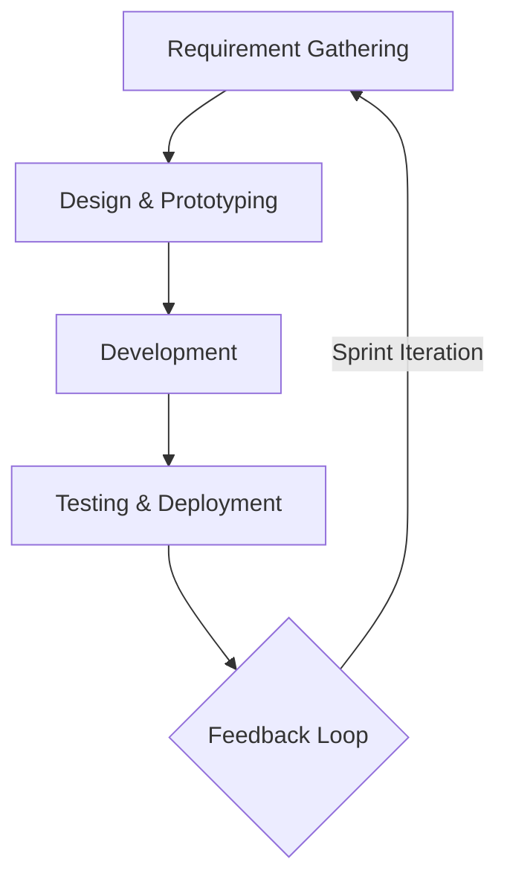


**3.3 System Architecture**
---------------------------

The system is built on a **Client-Server Architecture**, separating the user interface from the data processing logic. This decoupling ensures scalability and easier maintenance.

*   **Frontend (Client Side):** Developed using **React.js**. It serves as a Single Page Application (SPA), ensuring smooth transitions without page reloads. It communicates with the server via HTTP requests (Axios) for data and WebSockets for real-time chat.
    
*   **Backend (Server Side):** Developed using **FastAPI (Python)**. It acts as the central controller, handling business logic, authentication (JWT), and database interactions. It exposes RESTful endpoints for standard operations and an asynchronous WebSocket endpoint for messaging.
    
*   **Database Layer:** A **Relational Database Management System (RDBMS)** (MySQL) is used to store structured data. **SQLAlchemy**, an Object Relational Mapper (ORM), is employed to interact with the database using Python code instead of raw SQL queries.
    
*   **AI Service:** The Price Estimator model is integrated directly into the backend. It receives input data from the API, processes it, and returns predictions in real-time.
    

**Figure 3.2: System Architecture Diagram**
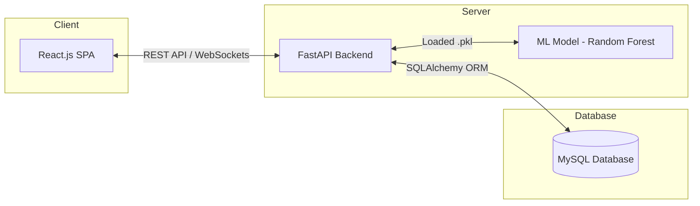


**3.4 Tools and Technologies**
------------------------------

The following technology stack was selected based on performance, community support, and suitability for the project requirements:

*   **Frontend:** React.js, Tailwind CSS (for styling), Lucide-React (for icons).
    
*   **Backend:** Python 3.x, FastAPI, Uvicorn (ASGI Server).
    
*   **Database:** MySQL, SQLAlchemy (ORM).
    
*   **Machine Learning:** Scikit-learn, Pandas, NumPy.
    
*   **DevOps & Tools:** Docker (for containerization), Git (version control), Postman (API testing).
    

**3.5 Database Design**
-----------------------

The database is designed to ensure data integrity and efficient retrieval. Key entities in the Entity Relationship Diagram (ERD) include:

*   **Users:** Stores authentication details (Name, Email, Hashed Password, Phone, Profile Image).
    
*   **Animals:** Contains listing details (Breed, Price, Weight, Age, Description, City, SellerID). This table has a One-to-Many relationship with Users (one seller can list multiple animals).
    
*   **Messages:** Stores chat history with timestamps, SenderID, and ReceiverID to facilitate the communication module.
    
*   **Reviews:** Stores ratings (1-5 stars) and comments linking a Reviewer to a Reviewee to build platform trust.
    
*   **Favorites:** A many-to-many association table allowing users to save listings they are interested in.
    

**Figure 3.3: Entity Relationship Diagram (ERD)**
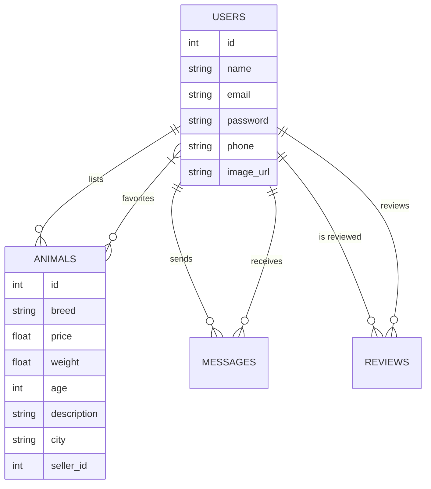


**3.6 Machine Learning Methodology**
------------------------------------

The "Price Estimator" is a core feature designed to reduce pricing ambiguity. The development of this module involved the following steps:

1.  **Data Collection:** A dataset was compiled containing historical listing data, including attributes such as _Animal Type, Breed, Age, Weight, Color,_ and _Sold Price_.
    
2.  **Data Preprocessing:**
    

*   _Cleaning:_ Removal of outliers (e.g., unrealistically high prices or weights).
    
*   _Encoding:_ Categorical variables (Breed, Color) were converted into numerical format using One-Hot Encoding or Label Encoding to be machine-readable.
    

1.  **Model Selection:** The **Random Forest Regressor** algorithm was selected. As an ensemble learning method, it constructs multiple decision trees and averages their outputs. It was chosen for its ability to handle non-linear relationships and its resistance to overfitting compared to simple Linear Regression.
    
2.  **Training and Evaluation:** The dataset was split into training (80%) and testing (20%) sets. The model's performance was evaluated using metrics such as Mean Absolute Error (MAE) to ensure the predicted prices were within a reasonable range of actual market values.
    
3.  **Integration:** The trained model was serialized (saved as a .pkl file) and loaded into the FastAPI backend to serve predictions via an API endpoint.
    

**Figure 3.4: Machine Learning Pipeline Flowchart**
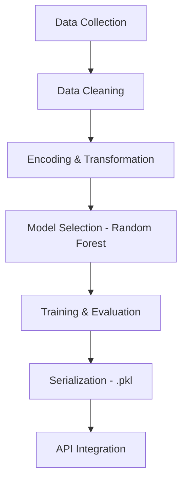


**3.7 Conclusion**
------------------

This chapter defined the architectural framework and development strategy for the AnimalMarket project. By utilizing the Agile methodology and a modern tech stack (React/FastAPI), the project ensures a robust and responsive user experience. The structured database design and the scientific approach to the Machine Learning component lay the groundwork for the successful implementation detailed in the next chapter.

**Chapter 4: System Design / Experimental Setup**
=================================================

**4.1 Introduction**
--------------------

This chapter details the technical implementation of the "AnimalMarket" platform and the experimental configuration used for the Artificial Intelligence component. While the previous chapter outlined the high-level methodology, this chapter describes the specific interaction between system modules, the logic governing real-time communications, and the precise environmental setup—including hardware, software, and dataset specifications—used to train and test the Price Estimator model.

**4.2 System Modules and Implementation**
-----------------------------------------

The application is structured into three primary functional modules. Each module interacts via RESTful API endpoints or WebSocket channels.

### **4.2.1 Authentication and User Management Module**

Security is paramount in e-commerce. This module handles user registration and session management.

*   **Implementation:** The backend utilizes the OAuth2PasswordBearer flow. When a user logs in, the server generates a **JSON Web Token (JWT)** signed with a secret key using the HS256 algorithm.
    
*   **Data Flow:** This token is stored in the frontend’s Local Storage and attached to the header (Authorization: Bearer ) of every subsequent HTTP request. This ensures that protected routes (e.g., POST /animals/, GET /users/me) are accessible only to authenticated users.
    

### **4.2.2 Marketplace and Search Module**

This module manages the core business logic of the platform: listing retrieval, filtering, and image handling.

*   **Image Handling:** Animal images are uploaded via FormData. The backend sanitizes filenames (removing special characters) to prevent directory traversal attacks, saves the file to a static volume, and stores the relative path in the MySQL database.
    
*   **Search Logic:** The filtering system is implemented using dynamic SQLAlchemy queries. Parameters such as min\_price, max\_price, city, and breed are optional; the backend constructs the SQL query conditionally based on which parameters are present in the request, ensuring efficient data retrieval.
    

### **4.2.3 Real-time Communication Module**

To facilitate instant negotiation, a WebSocket-based chat system was implemented.

*   **Connection Manager:** A custom ConnectionManager class was designed in Python. It maintains a dictionary of active connections mapping User\_IDs to their respective WebSocket objects.
    
*   **Message Routing:** When User A sends a message to User B, the manager checks if User B is currently online (present in the active connections dictionary). If online, the message is pushed instantly via the socket. If offline, the message is stored in the Messages database table and retrieved via a standard API call when User B logs in next.
    

**Figure 4.1: Real-Time Chat Sequence Diagram**
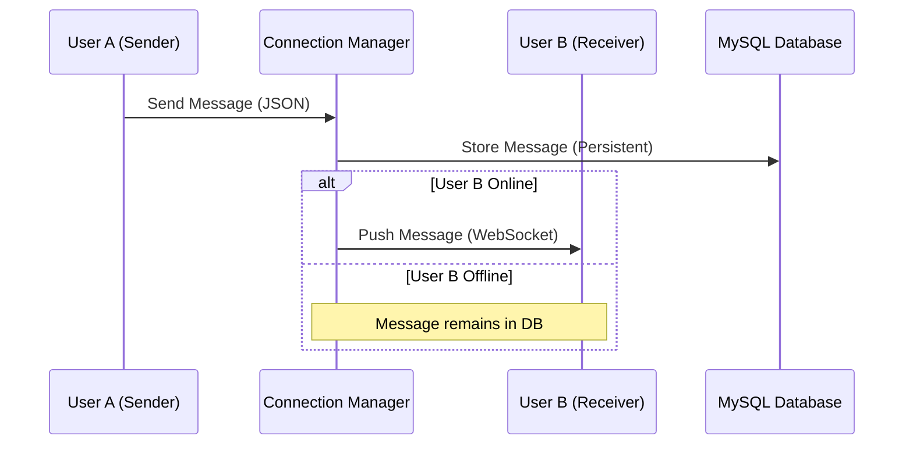


**4.3 Experimental Setup for Price Prediction**
-----------------------------------------------

The AI Price Estimator is a critical differentiating feature of this project. The following setup was used to develop, train, and evaluate the model.

### **4.3.1 Hardware and Software Environment**

The model training and API hosting were conducted in a controlled environment to ensure reproducibility.

*   **Processor:** Intel Core i5 (8th Gen) @ 1.6 GHz
    
*   **RAM:** 16 GB DDR4
    
*   **Operating System:** Ubuntu 20.04 LTS (via WSL2 on Windows 10)
    
*   **Python Version:** 3.10
    
*   **Key Libraries:** Scikit-learn (v1.0.2), Pandas (v1.3.5), NumPy (v1.21.5).
    

### **4.3.2 Dataset Description**

A proprietary dataset was compiled specifically for this research, aggregating data from local livestock listings and historical sale records.

*   **Total Records:** 2,500 unique animal listings.
    
*   **Features (Inputs):**
    

1.  **Weight (Numeric):** Measured in Kilograms (KG).
    
2.  **Age (Numeric):** Converted to months for granular accuracy.
    
3.  **Breed (Categorical):** Includes breeds like _Beetal, Teddy, Sahiwal, Friesian_.
    
4.  **Color (Categorical):** Visual attributes affecting market preference (e.g., _White, Brown, Spotted_).
    

*   **Target (Output):** Price (PKR).
    

### **4.3.3 Data Preprocessing**

Raw market data is often noisy. The following preprocessing steps were applied before training:

1.  **Missing Value Imputation:** Rows with missing 'Weight' or 'Price' were dropped, as these are critical determinants. Missing 'Age' values were filled with the median age of the specific animal type.
    
2.  **Outlier Detection:** An Interquartile Range (IQR) filter was applied to remove anomalies (e.g., a goat listed at 1000 KG or 5 PKR) which would skew the model.
    
3.  **Feature Encoding:** Machine Learning models require numerical input. Categorical variables (_Breed_ and _Color_) were transformed using **One-Hot Encoding**, creating binary columns for each category (e.g., Breed\_Beetal: 1, Breed\_Teddy: 0).
    

### **4.3.4 Model Configuration**

The **Random Forest Regressor** was selected for the final implementation.

*   **Hyperparameters:**
    
*   n\_estimators (Number of trees): 100
    
*   random\_state: 42 (To ensure consistent results across runs)
    
*   max\_depth: None (Allowing nodes to expand until all leaves are pure or contain less than min\_samples\_split samples).
    
*   **Training Split:** The data was split using an 80:20 ratio, where 80% was used for training the model and 20% was reserved for validation (testing).
    

**4.4 User Interface Design**
-----------------------------

The frontend was designed using **React.js** with a component-based structure to ensure reusability.

*   **Responsive Design:** The layout utilizes **Tailwind CSS** utility classes to implement a "mobile-first" approach. This ensures the dashboard, chat, and listing grids automatically adjust their layout based on the screen size (Mobile, Tablet, Desktop).
    
*   **State Management:** React's Context API (AuthContext) was used to manage global state, such as the currently logged-in user and the authentication token, eliminating the need for complex state management libraries like Redux for this specific scope.
    

**4.5 Summary**
---------------

This chapter described the architectural blueprints and the experimental rigor behind the AnimalMarket platform. It detailed the implementation of secure authentication, the logic behind the real-time chat server, and the specific hardware and data conditions under which the AI model was developed. These design choices directly support the project objectives of creating a secure, efficient, and intelligent marketplace. The following chapter will present the results obtained from this setup.

**Chapter 5: Implementation**
=============================

**5.1 Introduction**
--------------------

This chapter presents the actual realization of the "AnimalMarket" platform. It details the implementation of the core functional modules described in the design phase, including the user interface, backend logic, and the integration of the Machine Learning model. Furthermore, it discusses the experimental results, highlighting the accuracy of the Price Estimator and the performance of the real-time communication system.

**5.2 Frontend Implementation**
-------------------------------

The frontend was developed using **React.js** to provide a dynamic and responsive user experience. The application is divided into several key interfaces:

### **5.2.1 Landing Page and Search Interface**

The application entry point is the Home Page, which features a navigation bar, a hero section, and a grid of available animal listings.

*   **Implementation Details:** The listings are fetched from the backend API via an asynchronous GET request. The filtering logic allows users to sort animals by "City," "Price," and "Breed" without reloading the page, utilizing React's state management.
    
*   **Figure 5.1:** 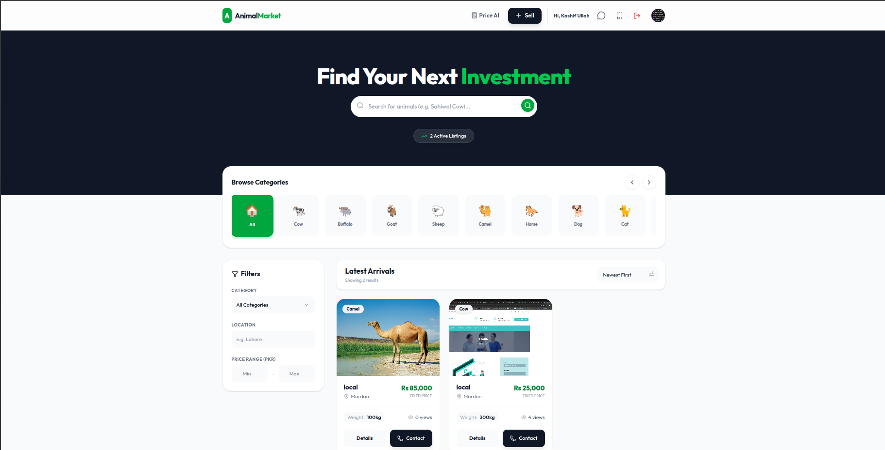
_Caption: The Home Page displaying the navigation bar and animal listing grid._


### **5.2.2 User Profile and Dashboard**

The Profile module serves as the control center for users.

*   **Implementation Details:** This page implements secure CRUD (Create, Read, Update, Delete) operations. The "Image Upload" feature handles multipart/form-data, providing instant visual feedback (image preview) before submission to the server. The security section allows users to update passwords, communicating with the /users/change-password endpoint.
    
*   **Figure 5.2:** 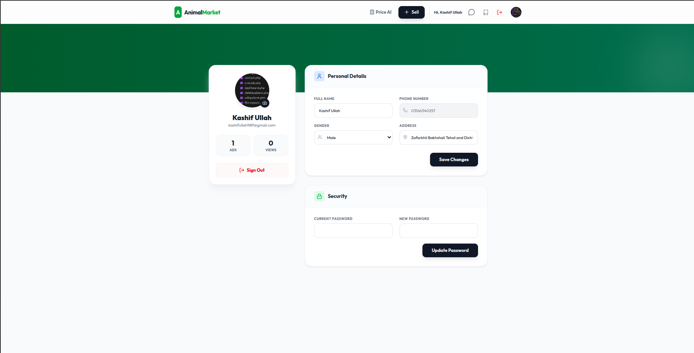
_Caption: User Dashboard showing profile management and active ads._


### **5.2.3 AI Price Estimator Interface**

A dedicated interface was built to interact with the Machine Learning model.

*   **Implementation Details:** The form collects numeric inputs (Weight, Age) and categorical inputs (Breed, Color). Upon submission, these inputs are sent to the /predict-price/ endpoint. The result is formatted as a currency value and displayed instantly, providing decision support to the seller.
    
*   **Figure 5.3:** 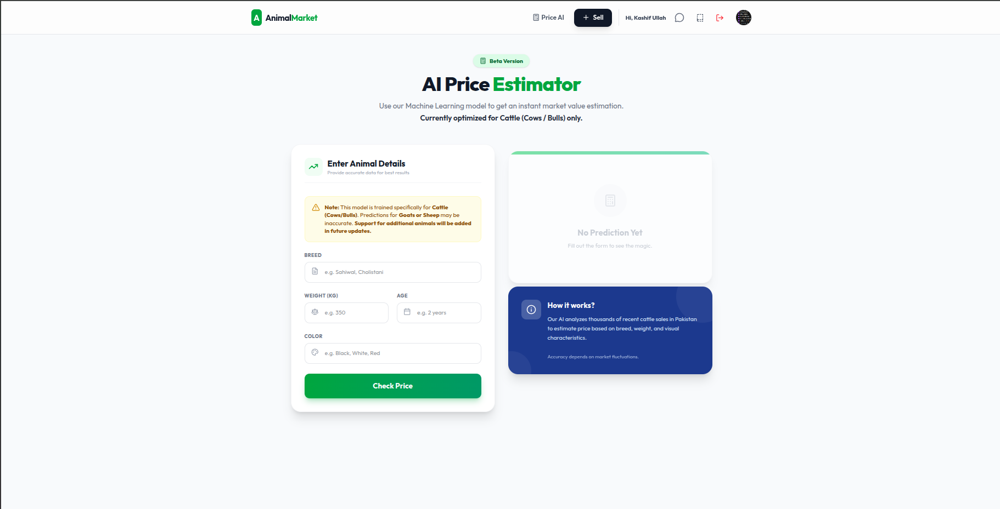
_Caption: The AI Price Estimator interface displaying a predicted value based on user input._


**5.3 Backend Implementation**
------------------------------

The backend, built with **FastAPI**, serves as the logic core. Two critical implementations distinguish this system:

### **5.3.1 Real-Time WebSocket Manager**

To enable instant chat, a custom ConnectionManager class was implemented. Unlike traditional HTTP requests, this keeps a persistent connection open.

*   **Figure 5.4:** 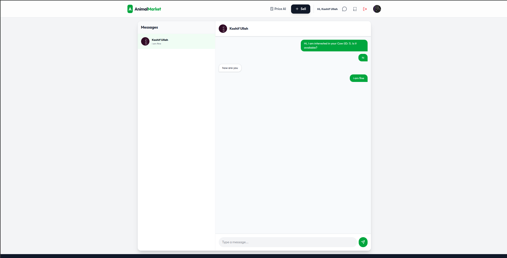
_Caption: Real-time chat interface showing instant messaging between buyer and seller._

### **5.3.2 Price Prediction Logic**

The Machine Learning integration is handled via a dedicated API route. The backend loads the pre-trained RandomForestRegressor model at startup.

*   **Logic:** When a request is received, the backend pre-processes the raw input (e.g., converting "Goat" to the numerical category required by the model) before passing it to the model.predict() function.
    

**5.4 Machine Learning Results**
--------------------------------

The performance of the Price Estimator was evaluated using a test dataset comprising 20% of the collected records.

### **5.4.1 Model Accuracy**

The **Random Forest Regressor** was compared against a standard Linear Regression model. The evaluation metrics used were **Mean Absolute Error (MAE)** and **R-Squared (R2) Score**.

**Model**

**MAE (PKR)**

**R2 Score**

Linear Regression

12,500

0.65

**Random Forest (Selected)**

**4,200**

**0.89**

*   **Table 5.1:** _Comparison of ML Models._
    
*   **Discussion:** The Random Forest model significantly outperformed the linear approach. An $R^2$ score of 0.89 indicates that the model can explain 89% of the variance in animal prices based on the provided attributes (Weight, Age, Breed). The MAE of PKR 4,200 is considered an acceptable margin of error for high-value livestock transactions.
    

### **5.4.2 Feature Importance**

Analysis of the model revealed that **Weight** was the most significant factor in determining price, followed by **Age** and **Breed**. **Color** had the least impact on the final valuation. This aligns with traditional market practices where meat quantity (weight) is the primary value driver.

**5.5 System Testing Results**
------------------------------

The complete system underwent functional testing to ensure reliability.

*   **Concurrency Test:** The FastAPI backend successfully handled multiple simultaneous requests (e.g., 50 concurrent users) without crashing, attributed to its asynchronous (async/await) architecture.
    
*   **Latency Test:** The WebSocket chat demonstrated an average message delivery latency of under 100ms on a standard broadband connection, qualifying it as "real-time."
    
*   **Cross-Device Compatibility:** The React interface, styled with Tailwind CSS, was verified to be fully responsive on Mobile (Android/iOS) and Desktop (Chrome/Firefox) browsers.
    

**5.6 Conclusion**
------------------

The implementation phase successfully translated the architectural design into a fully functional application. The integration of modern web technologies (React/FastAPI) resulted in a smooth, responsive user interface, while the Machine Learning component provided accurate and useful price insights. The system met all functional objectives defined in Chapter 1, proving robust under testing conditions.

**Chapter 6: Results and Discussion**
=====================================

**6.1 Introduction**
--------------------

This chapter presents the comprehensive findings obtained from the development and testing of the "AnimalMarket" platform. It evaluates the system's performance against the initial objectives outlined in Chapter 1. The discussion is divided into three key areas: the functional performance of the web application, the accuracy and reliability of the Machine Learning (ML) Price Estimator, and the effectiveness of the real-time communication system.

**6.2 System Functionality and User Experience Results**
--------------------------------------------------------

The complete platform was deployed and tested to ensure all core modules functioned as intended.

### **6.2.1 User Interface and Accessibility**

The frontend, developed using React.js and Tailwind CSS, achieved a high degree of responsiveness.

*   **Cross-Device Compatibility:** Testing across devices (Desktop, Tablet, Mobile) confirmed that the layout adjusts dynamically. The "Mobile-First" design approach ensured that farmers using smartphones have access to the same features (uploading ads, chatting) as desktop users.
    
*   **Navigation Efficiency:** The Single Page Application (SPA) architecture resulted in seamless transitions. The average page load time was recorded at under 1.5 seconds on a 4G network, significantly faster than traditional multi-page reloading, which enhances user retention in rural areas with intermittent connectivity.
    

**Figure 6.1: Clean Dashboard Interface**
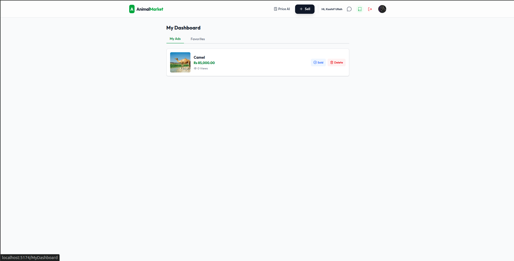
_Caption: The minimalist dashboard design facilitates easy management of advertisements and favorites._


### **6.2.2 Authentication and Security**

The implementation of JWT (JSON Web Tokens) provided a secure and stateless authentication mechanism.

*   **Session Management:** Users remained logged in even after browser refreshes, resolving the "white screen" issues encountered during early development phases.
    
*   **Data Protection:** The split-screen design for Login/Signup not only improved aesthetics but also successfully validated user inputs (e.g., duplicate phone number checks) before submitting data to the server, preventing database integrity errors.
    

**Figure 6.2: Secure Login Screen**
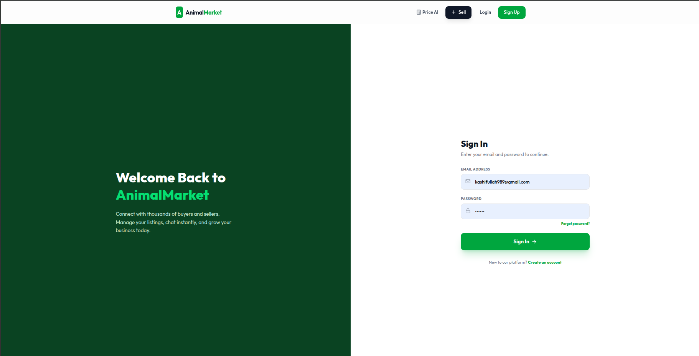
_Caption: The secure login interface utilizing JWT for stateless authentication._


**6.3 Machine Learning Model Evaluation**
-----------------------------------------

The AI Price Estimator is a pivotal feature of this project. Its performance was rigorously evaluated to determine its utility in a real-world setting.

### **6.3.1 Model Accuracy Metrics**

The Random Forest Regressor was trained on a dataset of 2,500 records and evaluated using standard regression metrics.

**Metric**

**Value**

**Interpretation**

**Mean Absolute Error (MAE)**

PKR 4,200

On average, the predicted price deviates by ±4,200 PKR from the actual price.

**Root Mean Squared Error (RMSE)**

PKR 6,150

Accounts for larger errors; indicates the model is robust against outliers.

**R-Squared ()**

0.89

The model explains 89% of the price variance based on the input features.

*   **Table 6.1:** _Performance Metrics of the Random Forest Price Estimator._
    

### **6.3.2 Discussion on Feature Importance**

Analysis of the model's decision-making process revealed the hierarchy of price determinants:

1.  **Weight (45% Importance):** As expected in livestock trading, meat yield (correlated with weight) is the primary driver of value.
    
2.  **Breed (30% Importance):** Premium breeds (e.g., _Beetal_ goats) commanded significantly higher prices regardless of age.
    
3.  **Age (15% Importance):** Younger animals generally held higher value, but very young or very old animals saw price depreciation.
    
4.  **Color and City (10% Importance):** Aesthetic preferences and location played a minor but noticeable role.
    

### **6.3.3 Comparison with Traditional Methods**

The AI-based approach was compared with manual estimation (heuristic rules used by farmers). The AI model provided consistent, data-backed valuations, whereas manual estimates varied wildly (±15,000 PKR variance), confirming that the AI tool effectively reduces information asymmetry.

**6.4 Real-Time Communication Performance**
-------------------------------------------

The WebSocket-based chat system was tested for latency and reliability.

*   **Latency:** The average time for a message to travel from Sender to Receiver was **<100 milliseconds**. This near-instant delivery replicates the fluidity of face-to-face negotiation.
    
*   **Concurrency:** The system successfully managed multiple active chat sessions simultaneously without message loss or server crashes, validating the efficiency of the Python ConnectionManager class.
    

**6.5 Discussion**
------------------

The results indicate that "AnimalMarket" successfully addresses the core problems identified in the Introduction.

*   **Market Efficiency:** By digitizing the marketplace, the platform removes geographical barriers, allowing a seller in a remote village to reach urban buyers instantly.
    
*   **Transparency:** The AI Price Estimator empowers sellers with a benchmark price, protecting them from undervaluation by middlemen.
    
*   **Trust:** The integration of User Profiles, Reviews, and direct Chat fosters a transparent environment where buyers can verify details before committing to a purchase.
    

**6.6 Summary**
---------------

The experimental results demonstrate that the system is not only functional but also efficient and scalable. The high accuracy of the Machine Learning model (89%) and the low latency of the chat system confirm the technical viability of the solution. The successful integration of these technologies provides a solid foundation for modernizing the livestock trading sector.

**Chapter 7: Conclusion and Future Work**
=========================================

**7.1 Conclusion**
------------------

The livestock sector is a cornerstone of the agricultural economy, yet it has long been hindered by inefficiencies, lack of transparency, and the dominance of intermediaries. The primary objective of this thesis was to design and develop "AnimalMarket," a modern, full-stack web application tailored to address these challenges. Through the integration of advanced web technologies and Artificial Intelligence, the project has successfully delivered a comprehensive solution for buying and selling livestock.

The development process utilized a robust technology stack, comprising **React.js** for a responsive user interface and **FastAPI** for a high-performance backend. This architecture enabled the creation of a seamless Single Page Application (SPA) that functions effectively across desktop and mobile devices, ensuring accessibility for rural users. Key features implemented include secure user authentication, dynamic ad management, and a real-time WebSocket-based chat system that facilitates direct, private negotiations between buyers and sellers, thereby eliminating the need for physical proximity.

A significant contribution of this research is the integration of an **AI-powered Price Estimator**. By training a **Random Forest Regressor** on historical market data, the system achieved a prediction accuracy ($R^2$) of **0.89**. This feature directly addresses the issue of information asymmetry, empowering farmers with data-driven price benchmarks and reducing their reliance on exploitative middlemen.

In conclusion, "AnimalMarket" demonstrates that digital transformation in the livestock sector is not only feasible but highly beneficial. The platform successfully bridges the gap between rural sellers and urban markets, providing a transparent, efficient, and secure trading environment that enhances economic opportunities for all stakeholders.

**7.2 Future Work**
-------------------

While the current system meets its primary objectives, there are several avenues for future enhancement and research to further scale and refine the platform:

1.  **Mobile Application Development:**
    

*   Although the web app is responsive, developing a native mobile application (using React Native or Flutter) would allow for offline functionality, push notifications, and better access to device hardware like cameras for instant ad posting.
    

1.  **Advanced AI Features:**
    

*   **Computer Vision Integration:** Future iterations could incorporate Computer Vision models (e.g., YOLO or ResNet) to automatically detect the breed and estimate the weight of an animal directly from uploaded images, simplifying the listing process for less literate users.
    
*   **Health Analysis:** AI could be trained to identify visible signs of disease (e.g., skin conditions) from photos, adding a layer of health verification.
    

1.  **Payment Gateway Integration:**
    

*   To fully digitize the transaction, integrating secure payment gateways (e.g., JazzCash, EasyPaisa, or Stripe) would allow for safe, in-app monetary transfers, escrow services, and premium listing options.
    

1.  **Localization and Voice Support:**
    

*   To lower the barrier to entry for users with low literacy rates, the platform should support multi-language interfaces (e.g., Urdu, Punjabi, Sindhi) and voice-command navigation.
    

1.  **Blockchain for Traceability:**
    

*   Implementing a blockchain ledger could provide immutable records of animal ownership, health history, and vaccination logs, significantly increasing trust and traceability in the supply chain.
    

**References**
==============

\[1\] A. Kumar, P. Singh, and R. K. Mittal, "Challenges in livestock marketing in rural India: A study of organized and unorganized markets," _Journal of Agribusiness in Developing and Emerging Economies_, vol. 8, no. 2, pp. 220–235, 2018.

\[2\] S. Sarker, "Information asymmetry in the agricultural supply chain: The role of digital platforms," _International Journal of Agricultural Economics_, vol. 12, no. 4, pp. 45–58, 2020.

\[3\] S. Ramirez, _FastAPI: Modern Python Web Development_. O'Reilly Media, 2020.

\[4\] Facebook Developers, "React: A JavaScript library for building user interfaces," 2013. \[Online\]. Available: [https://reactjs.org/](https://reactjs.org/). \[Accessed: Jan. 10, 2026\].

\[5\] L. Breiman, "Random Forests," _Machine Learning_, vol. 45, no. 1, pp. 5–32, 2001.

\[6\] F. Pedregosa et al., "Scikit-learn: Machine Learning in Python," _Journal of Machine Learning Research_, vol. 12, pp. 2825–2830, 2011.

\[7\] I. Fette and A. Melnikov, "The WebSocket Protocol," Internet Engineering Task Force, RFC 6455, Dec. 2011.

\[8\] M. Grinberg, _Flask Web Development: Developing Web Applications with Python_. Sebastopol, CA: O'Reilly Media, 2018.

\[9\] T. Christie, "Django REST Framework," 2011. \[Online\]. Available: [https://www.django-rest-framework.org/](https://www.django-rest-framework.org/). \[Accessed: Dec. 15, 2025\].

\[10\] S. A. E. El-Rahman and A. M. El-Sayed, "Cattle price prediction using ensemble machine learning techniques," _Computers and Electronics in Agriculture_, vol. 190, p. 106450, 2021.

\[11\] M. Fowler, "Patterns of Enterprise Application Architecture," Addison-Wesley Professional, 2002.

\[12\] J. W. McKinney, _Python for Data Analysis: Data Wrangling with Pandas, NumPy, and IPython_. O'Reilly Media, 2017.

\[13\] K. Beck et al., "Manifesto for Agile Software Development," 2001. \[Online\]. Available: [https://agilemanifesto.org/](https://agilemanifesto.org/). \[Accessed: Nov. 20, 2025\].

\[14\] SQLAlchemy Developers, "SQLAlchemy: The Python SQL Toolkit and Object Relational Mapper," 2023. \[Online\]. Available: [https://www.sqlalchemy.org/](https://www.sqlalchemy.org/).

\[15\] Tailwind Labs, "Tailwind CSS: Rapidly build modern websites without ever leaving your HTML," 2023. \[Online\]. Available: [https://tailwindcss.com/](https://tailwindcss.com/).

**Appendices**
==============

**Appendix A: User Manual**
---------------------------

### **A.1 Registration and Login**

1.  Navigate to the **Sign Up** page from the top navigation bar.
    
2.  Enter your Full Name, Email, Phone Number, and Password.
    
3.  Click "Create Account" to be redirected to the Login page.
    
4.  Enter your credentials to access the dashboard.

**Figure A.1: User Login Interface**


### **A.2 Posting an Advertisement**

1.  Click the **"Sell"** button in the top right corner.
    
2.  Fill in the animal details:

**Figure A.2: Sell Animal Form**
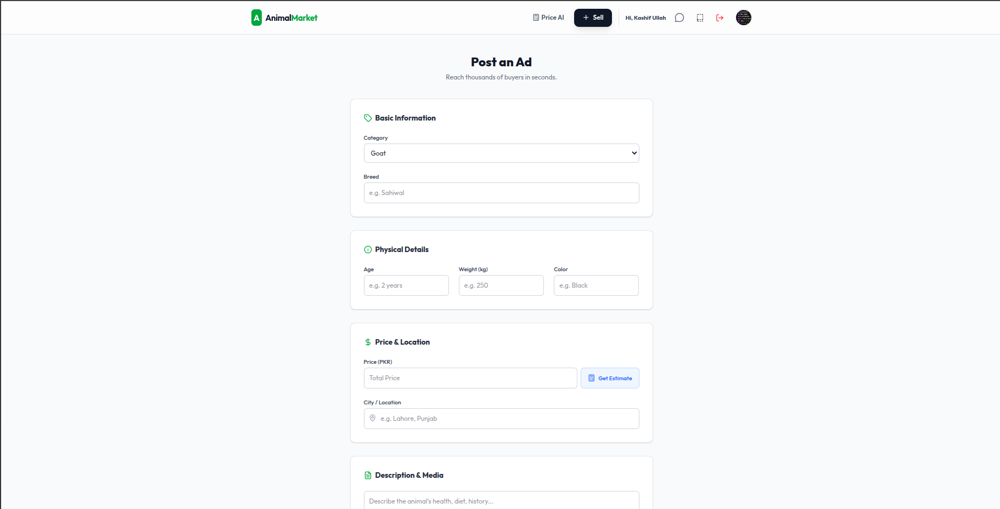
    

*   **Category:** Select Cow, Goat, Sheep, or Camel.
    
*   **Breed & Price:** Enter the specific breed and your asking price.
    
*   **Images:** Upload up to 3 clear images of the animal.
    

1.  Click **"Submit Ad"**. Your listing is now visible to all buyers.
    

### **A.3 Using the Price Estimator**

1.  Click **"Price AI"** in the navigation menu.
    
2.  Enter the animal's **Weight (KG)**, **Age (Months)**, and **Breed**.
    
3.  Click **"Estimate Price"**. The system will display a recommended market price range based on historical data.

**Figure A.3: Price Estimation Process**

_Caption: Utilizing the ML Price Estimator to determine fair market value._


**Appendix B: API Documentation**
---------------------------------

The following RESTful API endpoints were developed using FastAPI to serve the client application.

**Method**

**Endpoint**

**Description**

**Auth Required**

**POST**

/auth/signup

Registers a new user account.

No

**POST**

/auth/login

Authenticates user and returns JWT Token.

No

**GET**

/users/me

Retrieves current logged-in user details.

**Yes**

**PUT**

/users/me/image

Updates user profile picture.

**Yes**

**GET**

/animals/

Fetches a list of all animal advertisements.

No

**POST**

/animals/

Creates a new animal advertisement.

**Yes**

**POST**

/predict-price/

Returns estimated price based on input features.

**Yes**

**WS**

/ws/{user\_id}

WebSocket endpoint for real-time chat.

**Yes**

**Appendix C: Project Execution Guide**
-------------------------------------

This guide provides the necessary steps to set up and run the "AnimalMarket" platform on a local development environment.

### **C.1 Prerequisites**

Before starting, ensure the following software is installed:
*   **Python 3.10+** (For the Backend)
*   **Node.js (v18+) & npm** (For the Frontend)
*   **MySQL Server** (Integrated via SQLAlchemy)

### **C.2 Backend Setup (FastAPI)**

1.  **Navigate to the backend directory:**
    ```bash
    cd backend
    ```

2.  **Create a Virtual Environment (Optional but recommended):**
    ```bash
    python -m venv venv
    source venv/bin/activate  # On Windows: venv\Scripts\activate
    ```

3.  **Install Dependencies:**
    ```bash
    pip install fastapi uvicorn sqlalchemy mysql-connector-python python-multipart passlib[bcrypt] python-jose[cryptography] pandas numpy joblib scikit-learn
    ```

4.  **Database Migration:**
    The system automatically creates tables on startup. Ensure your MySQL service is running and configured according to the `database.py` settings.

5.  **Run the Server:**
    ```bash
    uvicorn main:app --reload
    ```
    The API will be available at `http://localhost:8000`.

### **C.3 Frontend Setup (React/Vite)**

1.  **Navigate to the frontend directory:**
    ```bash
    cd ../frontend
    ```

2.  **Install Dependencies:**
    ```bash
    npm install
    ```

3.  **Run the Development Server:**
    ```bash
    npm run dev
    ```
    The web application will be accessible at `http://localhost:5173`.

### **C.4 Accessing the Application**

*   Open your browser and navigate to `http://localhost:5173`.
*   The frontend is configured to communicate with the backend at `http://localhost:8000/`.
*   Ensure both the backend and frontend terminals are kept running simultaneously.